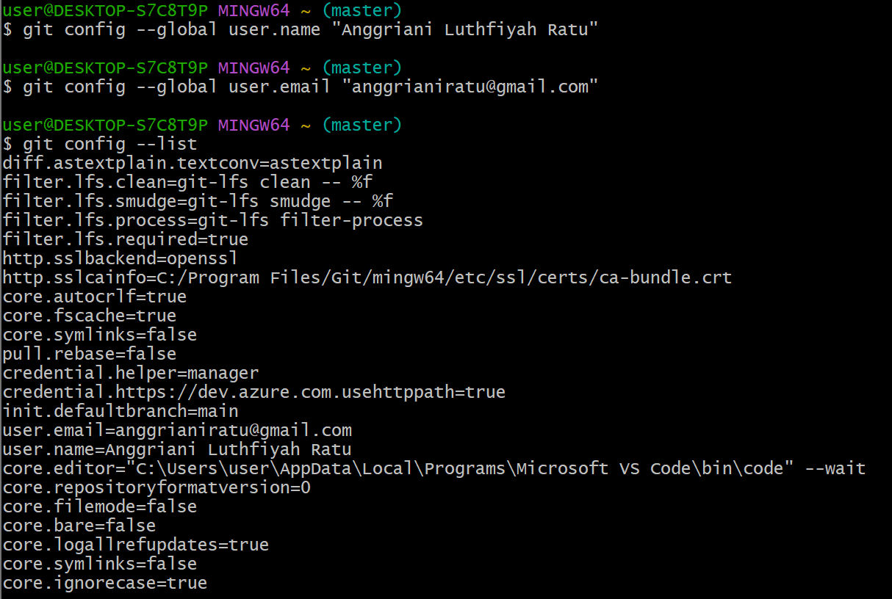
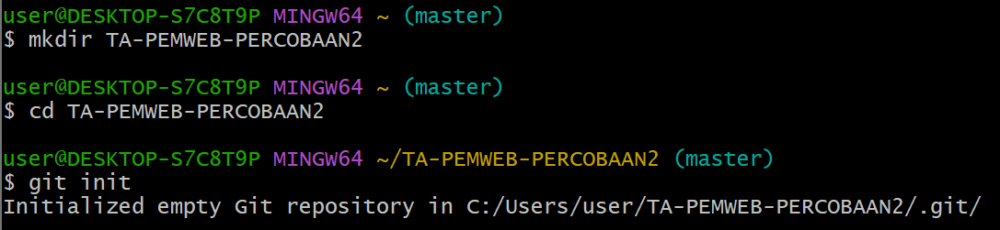
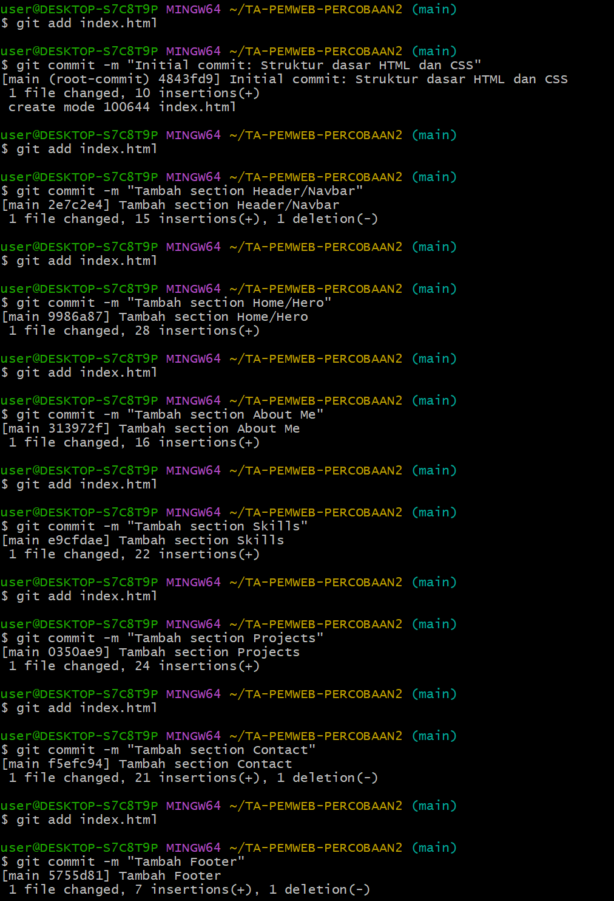
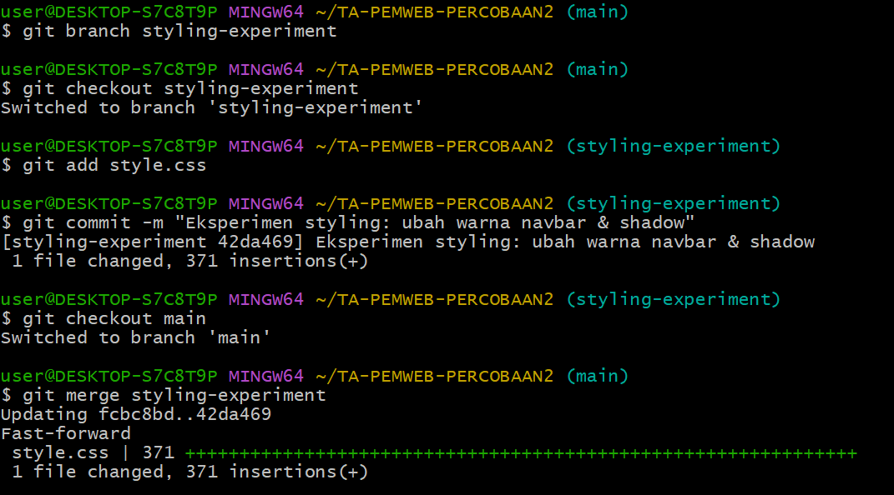

# *Personal Portfolio Website*

Website portfolio ini dibuat untuk menampilkan profil pribadi, keahlian, proyek, serta informasi kontak secara menarik dan responsif dalam satu halaman. 
Proyek ini disusun menggunakan HTML dan CSS dengan struktur yang sederhana, bersih, dan mudah dikembangkan di masa depan.

## Biodata

* Nama             : Anggriani Luthfiyah Ratu  
* Universitas      : Universitas Lampung  
* Program Studi    : Teknik Informatika  
* Konsentrasi      : Rekayasa Perangkat Lunak (RPL)
* Minat            : Web Development & UI/UX Design

## Struktur Folder

pemweb-percobaan2/  
├── index.html  
├── style.css  
├── foto.jpg  
└── README.md

## Fitur Website

1. **Header/Navbar**: Navigasi ke setiap section halaman.  
2. **Home/Hero**: Menampilkan nama, foto profil, dan social media.  
3. **About Me**: Berisi biodata singkat dan latar pendidikan.  
4. **Skills**: Menampilkan keahlian teknis seperti HTML, CSS, Git, dsb.  
5. **Projects**: Menampilkan proyek yang pernah dibuat.  
6. **Contact**: Formulir untuk mengirim pesan.  
7. **Footer**: Copyright dan informasi akhir halaman.

## Teknologi yang Digunakan

1. **HTML** : Membuat struktur dasar halaman website.
2. **CSS** : Memberikan warna, layout, dan tampilan visual.
3. **Git** : Mencatat perubahan (version control).
4. **GitHub** : Menyimpan project ke repository online.


# *WORKFLOW GIT*

## 1. **Instalasi dan Konfigurasi Git**
   
  ```bash
   git config --global user.name "Nama Anda"
   git config --global user.email "email@example.com"
   git config --list
   ```

## 2. **Membuat Repository Lokal**
   
   ```bash
   mkdir nama-folder-proyek
   cd nama-folder-proyek
   git init
   ```

## 3. **Commit dan History**
   

   #### a. Tambahkan file ke staging area
   ```bash
   git add index.html
   ```

   #### b. Commit perubahan dengan pesan
   ```bash
   git commit -m "Tambah section Header/Navbar"
   ```

   #### c. Commit untuk setiap section berikutnya
   ```bash
   git commit -m "Tambah section Home/Hero"
   git commit -m "Tambah section About Me"
   git commit -m "Tambah section Skills"
   git commit -m "Tambah section Projects"
   git commit -m "Tambah section Contact"
   git commit -m "Tambah Footer"
   ```

   ### Riwayat Commit
   
   ```bash
   git log
   ```
   
   ```bash
   git log --oneline
   ```

   ### Menambahkan file tambahan seperti stylesheet dan foto profil:
   
   ```bash
   git add foto.jpg style.css
   git commit -m "Menambahkan foto dan style.css"
   ```

## 4. Branching dan Merging
   
   #### a. Membuat branch baru untuk eksperimen styling
   ```bash
   git branch styling-experiment
   ```

   #### b. Pindah ke branch tersebut
   ```bash
   git checkout styling-experiment
   ```

   #### c. Tambahkan perubahan styling (misal: ubah warna navbar & shadow)
   ```bash
   git add style.css
   ```

   #### d. Commit perubahan di branch styling
   ```bash
   git commit -m "Eksperimen styling: ubah warna navbar & shadow"
   ```

   #### e. Kembali ke branch utama (main)
   ```bash
   git checkout main
   ```

   #### f. Gabungkan (merge) branch eksperimen ke main
   ```bash
   git merge styling-experiment
   ```


   ### Menampilkan riwayat commit
   
   ```bash
   git log --graph --oneline
   ```

## 5. Remote Repository dengan GitHub
   
   #### a. Hubungkan repository lokal ke GitHub (ganti URL dengan punyamu)
   ```bash
   git remote add origin https://github.com/username/nama-project.git
   ```

   #### b. Pastikan branch utama bernama 'main'
   ```bash
   git branch -M main
   ```

   #### c. Upload (push) semua commit ke GitHub
   ```bash
   git push -u origin main
   ```


## Contact

* Email     : anggrianiratu@gmail.com 
* Instagram : https://instagram.com/anggriani.ratu  
* LinkedIn  : https://www.linkedin.com/in/anggriani-luthfiyah-ratu-259140294  

### Author
Anggriani Luthfiyah Ratu  
Informatics Student ~
